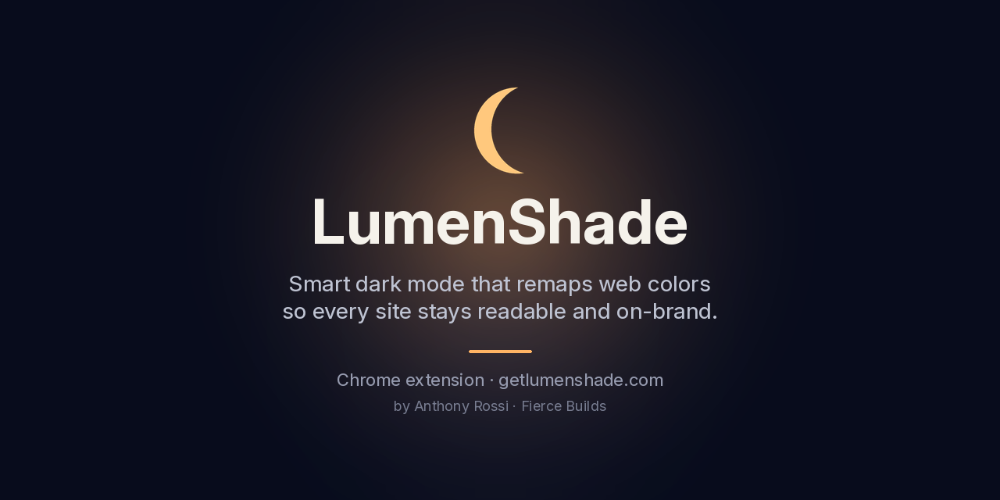

# LumenShade — Smart Dark Mode

Smart dark mode that perceptually remaps web colors with OKLCH. Eye-friendly and brand-aware, with per-domain controls.

**[Install from the Chrome Web Store](https://chromewebstore.google.com/detail/hkjpcdinaoicljnndoeoalaabdpododh)** · **Website:** [getlumenshade.com](https://getlumenshade.com)

## Features
- Remaps each site's colors perceptually using the OKLCH color space, instead of just inverting them
- Brand-aware, so sites keep their look while going dark
- Per-domain controls, so each site can be on, off, or tuned
- Built accessibility-first for comfortable, readable browsing

## Tech
Chrome extension (Manifest V3) · JavaScript/TypeScript · OKLCH color math

## How I built it
I designed and built LumenShade myself using AI-assisted development (Lovable/Dyad/Cursor), then tested, refined, and published it to the Chrome Web Store. I own the full lifecycle, from design to release.

---
Built by [Anthony Rossi](https://www.linkedin.com/in/anthonyrossi01) · [Fierce Builds](https://www.fiercebuilds.com/portfolio)
